# CourtMastr v2 — Architecture Flow

> **Human visual:** Open [`diagrams/connection-map.html`](diagrams/connection-map.html) in a browser for the full interactive grid.
> **AI/docs:** Use the Mermaid diagram and tables below.

---

## System Overview

CourtMastr is a Vue 3 + Firebase tournament management platform. It follows a strict layered architecture:

```
UI Views (Vue/Vuetify)
    ↓  import
Pinia Stores + Composables
    ↓  call via httpsCallable
Cloud Functions (Firebase)
    ↓  read/write
Firestore Collections
    ↑  real-time listeners (VueFire) back to stores
```

All state is owned by **Pinia stores**. Views never call Firebase directly. Cloud Functions are the only path for write-heavy or transactional operations (bracket generation, score advancement, scheduling). Simple CRUD flows go store → Firestore SDK directly.

---

## Full Connection Map (Mermaid)

```mermaid
flowchart LR

  %% ── SCORING ──
  subgraph SCORING["⚡ Scoring"]
    SIV["ScoringInterfaceView"]
    MLV["MatchListView"]
    LSV["LiveScoringView"]
    matchesStore(["matchesStore"])
    registrationsStore_s(["registrationsStore"])
    volunteerAccessStore_s(["volunteerAccessStore"])
    uPR_s(["useParticipantResolver"])
    updateMatch[["CF: updateMatch"]]
    match_scores[("match_scores/")]
    match_bracket_s[("match/ ← winner advance")]
    auditLog_s[("auditLog/")]
  end

  SIV --> matchesStore
  MLV --> matchesStore
  LSV --> matchesStore
  SIV --> registrationsStore_s
  SIV --> volunteerAccessStore_s
  SIV --> uPR_s
  matchesStore --> updateMatch
  updateMatch --> match_scores
  updateMatch --> match_bracket_s
  updateMatch --> auditLog_s

  %% ── REGISTRATION ──
  subgraph REGISTRATION["📋 Registration"]
    RMV["RegistrationMgmtView"]
    SRV["SelfRegistrationView"]
    PV["ParticipantsView"]
    FDV["FrontDeskCheckInView"]
    SCV["SelfCheckInView"]
    registrationsStore_r(["registrationsStore"])
    tournamentsStore_r(["tournamentsStore"])
    uTSA(["useTournamentStateAdvance"])
    applyCheckIn[["CF: applyVolunteerCheckInAction"]]
    searchCheckIn[["CF: searchSelfCheckInCandidates"]]
    submitCheckIn[["CF: submitSelfCheckIn"]]
    registrations_r[("registrations/")]
    players_mirror[("players/ (tournament mirror)")]
  end

  RMV --> registrationsStore_r
  SRV --> registrationsStore_r
  PV --> registrationsStore_r
  FDV --> registrationsStore_r
  SCV --> registrationsStore_r
  RMV --> uTSA
  registrationsStore_r --> applyCheckIn
  registrationsStore_r --> searchCheckIn
  registrationsStore_r --> submitCheckIn
  applyCheckIn --> registrations_r
  submitCheckIn --> registrations_r
  registrationsStore_r --> players_mirror

  %% ── BRACKETS ──
  subgraph BRACKETS["🏆 Brackets"]
    BV["BracketsView"]
    SBV["SmartBracketView"]
    PBV["PublicBracketView"]
    tournamentsStore_b(["tournamentsStore"])
    bracketAdapter(["bracketMatchAdapter"])
    uBG(["useBracketGenerator"])
    generateBracket[["CF: generateBracket"]]
    match_b[("match/ (bracket structure)")]
    match_scores_b[("match_scores/ (initial)")]
    bracket_meta[("stage/ round/ group/ participant/")]
  end

  BV --> tournamentsStore_b
  SBV --> tournamentsStore_b
  PBV --> tournamentsStore_b
  tournamentsStore_b --> bracketAdapter
  bracketAdapter --> uBG
  tournamentsStore_b --> generateBracket
  generateBracket --> match_b
  generateBracket --> match_scores_b
  generateBracket --> bracket_meta

  %% ── COURTS / SCHEDULING ──
  subgraph COURTS["🏟️ Courts & Scheduling"]
    CV["CourtsView"]
    MCV["MatchControlView"]
    CatV["CategoriesView"]
    tournamentsStore_c(["tournamentsStore"])
    matchesStore_c(["matchesStore"])
    uMA(["useAutoAssignment"])
    uMS(["useMatchScheduler"])
    generateSchedule[["CF: generateSchedule"]]
    courts_c[("courts/")]
    match_scores_c[("match_scores/ ← scheduleTime, courtId")]
  end

  CV --> tournamentsStore_c
  MCV --> tournamentsStore_c
  MCV --> matchesStore_c
  CatV --> tournamentsStore_c
  tournamentsStore_c --> uMA
  tournamentsStore_c --> uMS
  tournamentsStore_c --> generateSchedule
  generateSchedule --> courts_c
  generateSchedule --> match_scores_c

  %% ── PLAYERS / ORGS ──
  subgraph PLAYERS_ORGS["👤 Players & Orgs"]
    PLV["PlayersListView"]
    PPV["PlayerProfileView"]
    OPV["OrgProfileView"]
    ODV["OrgDashboardView"]
    playersStore(["playersStore"])
    organizationsStore(["organizationsStore"])
    dashboardStore(["dashboardStore"])
    uPMH(["usePlayerMatchHistory"])
    aggregateStats[["CF: aggregatePlayerStats"]]
    players_g[("players (global)")]
    playerEmailIndex[("playerEmailIndex")]
    organizations[("organizations/")]
    org_members[("organizations/{id}/members/")]
    orgSlugIndex[("orgSlugIndex")]
  end

  PLV --> playersStore
  PPV --> playersStore
  PPV --> uPMH
  OPV --> organizationsStore
  ODV --> dashboardStore
  playersStore --> aggregateStats
  playersStore --> players_g
  playersStore --> playerEmailIndex
  organizationsStore --> organizations
  organizationsStore --> org_members
  organizationsStore --> orgSlugIndex

  %% ── ADMIN / AUTH ──
  subgraph ADMIN["🔐 Admin & Auth"]
    UMV["UserManagementView"]
    ALV["AuditLogView"]
    SDV["SuperDashboardView"]
    VAV["VolunteerAccessView"]
    LV["LoginView / RegisterView"]
    authStore(["authStore"])
    usersStore(["usersStore"])
    auditStore(["auditStore"])
    superAdminStore(["superAdminStore"])
    volunteerAccessStore_a(["volunteerAccessStore"])
    issueSession[["CF: issueVolunteerSession"]]
    setPin[["CF: setVolunteerPin"]]
    revealPin[["CF: revealVolunteerPin"]]
    submitBug[["CF: submitBugReport"]]
    users_a[("users/")]
    auditLog_a[("auditLog/")]
    volunteerAccess[("volunteerAccess/")]
    bugReports[("bugReports/")]
  end

  UMV --> usersStore
  ALV --> auditStore
  SDV --> superAdminStore
  VAV --> volunteerAccessStore_a
  LV --> authStore
  authStore --> users_a
  usersStore --> users_a
  auditStore --> auditLog_a
  volunteerAccessStore_a --> issueSession
  volunteerAccessStore_a --> setPin
  volunteerAccessStore_a --> revealPin
  setPin --> volunteerAccess
  authStore --> submitBug
  submitBug --> bugReports

  %% ── PUBLIC / OBS ──
  subgraph PUBLIC["🌐 Public & Overlays"]
    PSV["PublicScoringView"]
    PSched["PublicScheduleView"]
    OBSV["ObsScoreboardView"]
    OBV["OverlayBoardView"]
    HCV["HallOfChampionsView"]
    matchesStore_p(["matchesStore (read-only listener)"])
    tournamentsStore_p(["tournamentsStore (read-only)"])
    registrationsStore_p(["registrationsStore (read-only)"])
    uAnn(["useAnnouncements"])
    uHoC(["useHallOfChampions"])
    submitReview[["CF: submitReview"]]
    match_p[("match/ — public read, no auth")]
    match_scores_p[("match_scores/ — public read")]
    reviews[("reviews/")]
  end

  PSV --> matchesStore_p
  OBSV --> matchesStore_p
  OBV --> matchesStore_p
  OBV --> uAnn
  HCV --> uHoC
  matchesStore_p --> match_p
  matchesStore_p --> match_scores_p
  PSV --> submitReview
  submitReview --> reviews
```



---

## Store → Firestore Ownership

| Store | Owns / Primarily Writes | Also Reads |
|-------|------------------------|-----------|
| `tournamentsStore` | `tournaments/`, `categories/`, `courts/` | `match_scores/` |
| `matchesStore` | `match_scores/`, `match/` (scores only) | `registrations/`, `courts/` |
| `registrationsStore` | `registrations/`, `players/` (mirror) | — |
| `playersStore` | `players` (global), `playerEmailIndex` | `players/` (mirror) |
| `organizationsStore` | `organizations/`, `members/`, `orgSlugIndex` | — |
| `authStore` | `users/` | — |
| `usersStore` | `users/` | — |
| `auditStore` | `auditLog/` | — |
| `volunteerAccessStore` | `volunteerAccess/` (via CF) | — |
| `activitiesStore` | `activities/` | — |
| `alertsStore` | `alerts/` | — |
| `dashboardStore` | — | `tournaments`, `registrations`, `players`, `activities` (collectionGroup) |
| `reviewsStore` | `reviews/` (via CF) | — |

---

## Cloud Functions Summary

| Function | Called By | Reads | Writes |
|----------|-----------|-------|--------|
| `generateBracket` | `tournamentsStore` | `tournaments/`, `categories/`, `registrations/` | `match/`, `match_scores/`, `stage/`, `round/`, `group/`, `participant/` |
| `generateSchedule` | `tournamentsStore` | `tournaments/`, `courts/`, `match/` | `match_scores/` (scheduleTime, courtId) |
| `updateMatch` | `matchesStore` | `match/`, `match_scores/`, `registrations/` | `match_scores/`, `match/` (winner advance), `auditLog/` |
| `applyVolunteerCheckInAction` | `registrationsStore` | `volunteerAccess/` | `registrations/` (status, bibNumber, checkedInAt) |
| `searchSelfCheckInCandidates` | `registrationsStore` | `registrations/` | — |
| `submitSelfCheckIn` | `registrationsStore` | `registrations/` | `registrations/` (selfCheckedInAt) |
| `issueVolunteerSession` | `volunteerAccessStore` | `volunteerAccess/`, `users/` | — (returns token) |
| `setVolunteerPin` | `volunteerAccessStore` | — | `volunteerAccess/` (encrypted PIN) |
| `revealVolunteerPin` | `volunteerAccessStore` | `volunteerAccess/` | — |
| `aggregatePlayerStats` | `playersStore` | `match_scores/`, `registrations/` | `players/{id}/stats` |
| `submitReview` | `reviewsStore` | — | `reviews/` |
| `submitBugReport` | `authStore` | — | `bugReports/` |

---

## Key Composables (Shared Logic, No CF Calls)

| Composable | Used By | Purpose |
|-----------|---------|---------|
| `useParticipantResolver` | Scoring, Registration, Public | Map registrationId → display name |
| `useTournamentStateAdvance` | Registration, Settings | Progress tournament lifecycle state |
| `useBracketGenerator` | Brackets | Generate bracket from participants |
| `useAdvanceWinner` | Brackets, Scoring | Move winner to next match slot |
| `useAutoAssignment` | Courts | Auto-assign matches to available courts |
| `useMatchScheduler` | Courts | Schedule match queue per court |
| `usePlayerMatchHistory` | Players | Fetch player's past matches across tournaments |
| `useLeaderboard` | Leaderboard | Compute standings from match results |
| `useHallOfChampions` | Public | Fetch all-time championship records |
| `useAnnouncements` | Overlay | Real-time announcement ticker |
| `useDialogManager` | Match Control | Open/close dialogs programmatically |
| `useAsyncOperation` | Many | Standardised loading/error state for async ops |
