# Courtmaster Data Model Architecture

**Document Version:** 1.0
**Created:** February 1, 2026
**Migration Status:** ✅ **COMPLETE** (February 1, 2026)
**Status:** Migration Complete - Final State Documented

---

## Executive Summary

This document provides a complete analysis of Courtmaster's data model architecture, identifying critical inconsistencies between services and collections, defining the target unified architecture, and outlining a phased migration path.

### Key Findings

| Issue | Severity | Impact |
|-------|----------|--------|
| Three match collections (`/match`, `/match_scores`, `/matches`) | **CRITICAL** | Data out of sync, features broken |
| ID type mismatch (numbers vs strings) | **HIGH** | Winner advancement fails silently |
| Scheduling uses wrong collection | **HIGH** | Cloud Function scheduling doesn't work |
| advanceWinner uses legacy collection | **HIGH** | Bracket progression broken |

---

## Table of Contents

1. [Current State Architecture](#1-current-state-architecture)
2. [Data Model Inconsistencies](#2-data-model-inconsistencies)
3. [Service-to-Collection Matrix](#3-service-to-collection-matrix)
4. [Target State Architecture](#4-target-state-architecture)
5. [Migration Path](#5-migration-path)
6. [Diagrams](#6-diagrams)

---

## 1. Current State Architecture

### 1.1 Overview

The application currently has **two competing data flows** for bracket management and **three different collections** for match data:

```
┌─────────────────────────────────────────────────────────────────┐
│                     CURRENT STATE (BROKEN)                       │
├─────────────────────────────────────────────────────────────────┤
│                                                                  │
│   CLIENT SIDE                    CLOUD FUNCTIONS                 │
│   ───────────                    ───────────────                 │
│   useBracketGenerator ─┐         generateBracket ─┐              │
│   (NUMERIC IDs)        │         (STRING IDs)     │              │
│                        ▼                          ▼              │
│                   ┌─────────┐                ┌─────────┐         │
│                   │ /match  │ ◄── CONFLICT ──│ /match  │         │
│                   └─────────┘                └─────────┘         │
│                                                                  │
│   useMatchScheduler ───────────► /match_scores                   │
│   generateSchedule CF ─────────► /matches (WRONG!)               │
│                                                                  │
│   matches.ts store ◄───────────► /match + /match_scores (merged) │
│   advanceWinner CF ◄───────────► /matches (WRONG!)               │
│                                                                  │
└─────────────────────────────────────────────────────────────────┘
```

### 1.2 Firestore Collections

Under `/tournaments/{tournamentId}/`:

| Collection | Schema Type | Purpose | Status |
|------------|-------------|---------|--------|
| `/stage` | brackets-manager | Tournament stages | OK |
| `/group` | brackets-manager | Bracket groups (W/L/Finals) | OK |
| `/round` | brackets-manager | Rounds within groups | OK |
| `/match` | brackets-manager | **Bracket structure** | PRIMARY |
| `/match_game` | brackets-manager | Games in best-of series | OK |
| `/participant` | brackets-manager | Maps to registrations | OK |
| `/match_scores` | Custom | **Operational data** | KEEP |
| `/matches` | Legacy custom | **DEPRECATED** | REMOVE |
| `/registrations` | Custom | Player registrations | OK |
| `/categories` | Custom | Event categories | OK |
| `/courts` | Custom | Court management | OK |
| `/players` | Custom | Player profiles | OK |

---

## 2. Data Model Inconsistencies

### 2.1 The Three Match Collections Problem

#### `/match` (brackets-manager schema)
```typescript
interface BracketsMatch {
  id: string;                    // Document ID
  stage_id: string;              // Reference to stage
  group_id: string;              // Reference to group
  round_id: string;              // Reference to round
  number: number;                // Match number in round
  status: number;                // 0=Locked, 1=Waiting, 2=Ready, 3=Running, 4=Completed
  opponent1: {
    id: number | string | null;  // Participant ID (seeding position)
    position?: number;
    result?: 'win' | 'loss' | 'draw';
    score?: number;
  } | null;
  opponent2: { /* same structure */ } | null;
}
```

#### `/match_scores` (custom schema)
```typescript
interface MatchScore {
  // No id field - uses match ID as document ID
  status: string;                // "scheduled" | "ready" | "in_progress" | "completed"
  scores: GameScore[];           // Array of game scores
  courtId?: string;              // Assigned court
  scheduledTime?: Timestamp;     // When match is scheduled
  startedAt?: Timestamp;         // When match started
  completedAt?: Timestamp;       // When match finished
  winnerId?: string;             // Registration ID of winner
  sequence?: number;             // Scheduling sequence
}
```

#### `/matches` (legacy schema - TO BE REMOVED)
```typescript
interface LegacyMatch {
  id: string;
  tournamentId: string;
  categoryId: string;
  round: number;
  matchNumber: number;
  participant1Id?: string;       // Registration ID
  participant2Id?: string;       // Registration ID
  winnerId?: string;
  status: string;                // Same as match_scores
  courtId?: string;
  scheduledTime?: Timestamp;
  nextMatchId?: string;          // Where winner advances
  nextMatchSlot?: 'participant1' | 'participant2';
  loserNextMatchId?: string;     // For double elimination
  loserNextMatchSlot?: 'participant1' | 'participant2';
}
```

### 2.2 ID Type Inconsistency

| Adapter | File | ID Handling | Example |
|---------|------|-------------|---------|
| `ClientFirestoreStorage` | `src/services/brackets-storage.ts` | Keeps original type | `id: 1` (number) |
| `FirestoreStorage` | `functions/src/storage/firestore-adapter.ts` | Converts to string | `id: "1"` (string) |

**Code Comparison:**

```typescript
// CLIENT (brackets-storage.ts line 55-56)
normalized[key] = value.id; // Keep as is (number)

// SERVER (firestore-adapter.ts line 61-62)
normalized[key] = String(value.id); // Convert to string
```

**Impact:** When `updateMatch` CF compares `winnerId` against `opponent1.id`:
```typescript
// updateMatch.ts line 92-93
const opponent1Id = String(matchData.opponent1?.id ?? '');
if (opponent1Id === winnerIdStr) { ... }
```
If opponent1.id is `1` (number) and winnerId is `"1"` (string), comparison works.
If opponent1.id is `"1"` (string) and winnerId is `1` (number), comparison fails!

### 2.3 Status Format Inconsistency

| Location | Format | Values |
|----------|--------|--------|
| `/match.status` | Number | 0, 1, 2, 3, 4 |
| `/match_scores.status` | String | "scheduled", "ready", "in_progress", "completed" |
| `/matches.status` | String | Same as match_scores |

**Mapping (in bracketMatchAdapter.ts):**
```typescript
function convertBracketsStatus(bracketsStatus: number): MatchStatus {
  switch (bracketsStatus) {
    case 0: case 1: return 'scheduled';
    case 2: return 'ready';
    case 3: return 'in_progress';
    case 4: return 'completed';
    default: return 'scheduled';
  }
}
```

### 2.4 Scheduling Path Conflict

| Scheduler | Reads From | Writes To |
|-----------|------------|-----------|
| `useMatchScheduler` (client) | `/match` | `/match_scores` |
| `generateSchedule` (Cloud Function) | `/matches` | `/matches` |

**These two systems are completely disconnected!**

---

## 3. Service-to-Collection Matrix

### 3.1 Current State Matrix

| Service/Module | File Location | Reads | Writes | Issues |
|----------------|---------------|-------|--------|--------|
| **useBracketGenerator** | `src/composables/useBracketGenerator.ts` | `/registrations`, `/categories` | `/stage`, `/group`, `/round`, `/match`, `/match_game`, `/participant` | Uses NUMERIC IDs |
| **generateBracket CF** | `functions/src/bracket.ts` | `/registrations`, `/categories` | Same as above | Uses STRING IDs |
| **useMatchScheduler** | `src/composables/useMatchScheduler.ts` | `/match`, `/courts`, `/stage` | `/match_scores` | Correct pattern |
| **generateSchedule CF** | `functions/src/scheduling.ts` | `/matches` (WRONG) | `/matches` (WRONG) | Uses legacy collection |
| **matches.ts store** | `src/stores/matches.ts` | `/match`, `/match_scores`, `/registrations`, `/stage` | `/match_scores`, `/courts` | Correct, merges data |
| **updateMatch CF** | `functions/src/updateMatch.ts` | `/match` | `/match`, `/match_scores` | Correct pattern |
| **advanceWinner CF** | `functions/src/index.ts` | `/matches` (WRONG) | `/matches` (WRONG) | Uses legacy collection |
| **bracketMatchAdapter** | `src/stores/bracketMatchAdapter.ts` | `/match`, `/registrations` | None (read-only) | Correct |
| **tournaments.ts store** | `src/stores/tournaments.ts` | `/match_scores` | `/match_scores`, `/courts` | Correct |

### 3.2 Target State Matrix

| Service/Module | Reads | Writes |
|----------------|-------|--------|
| **BracketService** (unified) | `/registrations`, `/categories` | `/stage`, `/group`, `/round`, `/match`, `/match_game`, `/participant` |
| **SchedulingService** (unified) | `/match`, `/courts`, `/stage` | `/match_scores` (courtId, scheduledTime) |
| **ScoringService** (unified) | `/match`, `/match_scores` | `/match_scores` (scores, status), triggers bracket progression |
| **RegistrationService** | `/registrations`, `/players` | `/registrations`, `/players` |

### 3.3 Changes Required

| Service | Current → Target | Files to Modify |
|---------|------------------|-----------------|
| `ClientFirestoreStorage` | Numeric IDs → String IDs | `src/services/brackets-storage.ts` |
| `generateSchedule CF` | `/matches` → `/match` + `/match_scores` | `functions/src/scheduling.ts` |
| `advanceWinner CF` | `/matches` → brackets-manager API | `functions/src/index.ts` |
| Delete `/matches` usage | Remove all references | Multiple files |

---

## 4. Target State Architecture

### 4.1 Design Principles

1. **Single Source of Truth**: Each data type has exactly one authoritative collection
2. **Consistent ID Types**: All IDs stored as strings across client and server
3. **Clear Separation**: Bracket structure (rarely changes) vs Operational data (frequently changes)
4. **Remove Legacy**: Eliminate `/matches` collection entirely

### 4.2 Collection Responsibilities

```
┌─────────────────────────────────────────────────────────────────┐
│                     TARGET STATE (CLEAN)                         │
├─────────────────────────────────────────────────────────────────┤
│                                                                  │
│   BRACKET STRUCTURE (brackets-manager, write-once)               │
│   ─────────────────────────────────────────────────              │
│   /stage      - Tournament phases                                │
│   /group      - Winners/Losers/Finals brackets                   │
│   /round      - Rounds within brackets                           │
│   /match      - Match slots, opponent positions, progression     │
│   /match_game - Individual games in best-of series               │
│   /participant - Links seeding positions to registrations        │
│                                                                  │
│   OPERATIONAL DATA (custom, frequently updated)                  │
│   ─────────────────────────────────────────────                  │
│   /match_scores - scores[], status, courtId, scheduledTime,      │
│                   startedAt, completedAt, winnerId               │
│   /registrations - Player/team tournament entries                │
│   /categories   - Event categories                               │
│   /courts       - Court status and assignments                   │
│   /players      - Player profiles                                │
│                                                                  │
│   REMOVED                                                        │
│   ───────                                                        │
│   /matches - DELETED (legacy)                                    │
│                                                                  │
└─────────────────────────────────────────────────────────────────┘
```

### 4.3 Data Flow

```
┌────────────────┐     ┌─────────────────┐     ┌──────────────────┐
│ BracketService │────►│ /match          │◄────│ ScoringService   │
│ (create once)  │     │ (structure)     │     │ (read structure) │
└────────────────┘     └─────────────────┘     └────────┬─────────┘
                                                        │
                                                        ▼
┌────────────────┐     ┌─────────────────┐     ┌──────────────────┐
│ ScheduleService│────►│ /match_scores   │◄────│ ScoringService   │
│ (assign courts)│     │ (operational)   │     │ (write scores)   │
└────────────────┘     └─────────────────┘     └──────────────────┘
```

### 4.4 Unified Match View

The `bracketMatchAdapter` already does this correctly - it merges `/match` and `/match_scores`:

```typescript
// From matches.ts store, lines 106-126
for (const bMatch of bracketsMatches) {
  const adapted = adaptBracketsMatchToLegacyMatch(bMatch, registrations, categoryId, tournamentId);

  if (adapted) {
    const scoreData = matchScoresMap.get(adapted.id);
    if (scoreData) {
      if (scoreData.status) adapted.status = scoreData.status;
      if (scoreData.scores) adapted.scores = scoreData.scores;
      if (scoreData.courtId) adapted.courtId = scoreData.courtId;
      // ... merge other fields
    }
    adaptedMatches.push(adapted);
  }
}
```

---

## 5. Migration Path

**IMPORTANT: No Production Data Exists**

Since there is no production data, this migration is purely code changes. This significantly simplifies the process:
- No data migration or archiving needed
- No backward compatibility period required
- Can delete `/matches` collection immediately after code changes
- Testing uses fresh data generated on-demand
- More aggressive timeline possible

### Phase 1: Critical Fixes (Days 1-3)

#### Step 1.1: Unify ID Types
**Risk: MEDIUM** | **Files: 1** | **Time: 2 hours**

```typescript
// Change in src/services/brackets-storage.ts
// Line 55-56, change:
normalized[key] = value.id; // Keep as is (number)
// To:
normalized[key] = String(value.id); // Convert to string (match server)
```

**Test:** Generate bracket client-side, then complete a match via updateMatch CF.

#### Step 1.2: Fix advanceWinner Cloud Function
**Risk: HIGH** | **Files: 1** | **Time: 4 hours**

```typescript
// In functions/src/index.ts, advanceWinner function
// Change from:
const matchDoc = await db.collection('tournaments').doc(tournamentId)
  .collection('matches').doc(matchId).get();

// To:
const matchDoc = await db.collection('tournaments').doc(tournamentId)
  .collection('match').doc(matchId).get();

// And use brackets-manager for advancement instead of manual updates
```

#### Step 1.3: Fix generateSchedule Cloud Function
**Risk: HIGH** | **Files: 1** | **Time: 4 hours**

```typescript
// In functions/src/scheduling.ts
// Change from:
const matchesSnapshot = await db.collection('tournaments').doc(tournamentId)
  .collection('matches')  // WRONG
  .where('status', 'in', ['scheduled', 'ready'])

// To:
const matchesSnapshot = await db.collection('tournaments').doc(tournamentId)
  .collection('match')  // CORRECT
  .where('status', 'in', [0, 1, 2])  // Use numeric status for brackets-manager

// And write to /match_scores instead of /matches
```

#### Step 1.4: Delete /matches Collection (Can do immediately!)
**Risk: LOW** | **Files: 1** | **Time: 30 minutes**

Since there's no production data:
1. Remove `/matches` rules from `firestore.rules`
2. Deploy rules: `firebase deploy --only firestore:rules`
3. Done - no data to migrate or archive

### Phase 2: Code Cleanup (Days 4-5)

#### Step 2.1: Remove All /matches References
**Risk: LOW** | **Files: Multiple** | **Time: 2 hours**

Run grep to find and remove all references:
```bash
grep -r "collection('matches')" --include="*.ts" .
grep -r "collection.*matches" --include="*.ts" .
```

Delete or update every reference found.

#### Step 2.2: Standardize Status Handling
**Risk: MEDIUM** | **Files: 2-3** | **Time: 2 hours**

- Ensure `/match_scores.status` is the single source of truth for UI
- `/match.status` only used by brackets-manager internally

#### Step 2.3: Consolidate Adapters
**Risk: LOW** | **Files: 2** | **Time: 2 hours**

Ensure both `ClientFirestoreStorage` and `FirestoreStorage` have identical behavior.

### Phase 3: Verification (Day 6)

#### Step 3.1: Verify Real-Time Subscriptions
**Risk: LOW** | **Files: 1** | **Time: 1 hour**

Already implemented in matches.ts:
```typescript
// Line 162-164
const qScores = collection(db, `tournaments/${tournamentId}/match_scores`);
const unsubScores = onSnapshot(qScores, () => refresh());
```

#### Step 3.2: Integration Testing
**Risk: LOW** | **Time: 2 hours**

- Run full tournament workflow end-to-end
- Test with fresh data (no legacy concerns)

#### Step 3.3: Documentation Update
**Risk: LOW** | **Files: Documentation** | **Time: 1 hour**

- Update this document with final state
- Mark migration as complete

---

## 6. Diagrams

### 6.1 Current State - Data Flow Architecture

```mermaid
flowchart TB
    subgraph Client["CLIENT SIDE"]
        BG[useBracketGenerator<br/>NUMERIC IDs]
        MS[useMatchScheduler]
        Store[matches.ts store]
        Adapter[bracketMatchAdapter]
    end

    subgraph CloudFunctions["CLOUD FUNCTIONS"]
        GenBracket[generateBracket CF<br/>STRING IDs]
        GenSchedule[generateSchedule CF]
        UpdateMatch[updateMatch CF]
        AdvanceWinner[advanceWinner CF]
    end

    subgraph Firestore["FIRESTORE COLLECTIONS"]
        subgraph BracketsManager["Brackets-Manager Schema"]
            Stage[/stage]
            Group[/group]
            Round[/round]
            Match[/match<br/>PRIMARY]
            MatchGame[/match_game]
            Participant[/participant]
        end

        subgraph Custom["Custom Schema"]
            MatchScores[/match_scores<br/>KEEP]
            Matches[/matches<br/>LEGACY - REMOVE]
            Registrations[/registrations]
            Categories[/categories]
            Courts[/courts]
        end
    end

    BG -->|WRITE| Stage & Group & Round & Match & MatchGame & Participant
    GenBracket -->|WRITE| Stage & Group & Round & Match & MatchGame & Participant

    MS -->|READ| Match
    MS -->|WRITE| MatchScores

    GenSchedule -->|READ - WRONG!| Matches
    GenSchedule -->|WRITE - WRONG!| Matches

    Store -->|READ| Match & MatchScores
    Store -->|WRITE| MatchScores

    UpdateMatch -->|READ/WRITE| Match & MatchScores

    AdvanceWinner -->|READ - WRONG!| Matches
    AdvanceWinner -->|WRITE - WRONG!| Matches

    Adapter -->|READ| Match & Registrations

    style Matches fill:#ff6b6b,stroke:#c92a2a,color:#fff
    style GenSchedule fill:#ffa94d,stroke:#e67700
    style AdvanceWinner fill:#ffa94d,stroke:#e67700
    style BG fill:#ffa94d,stroke:#e67700
```

### 6.2 Target State - Unified Architecture

```mermaid
flowchart TB
    subgraph Services["UNIFIED SERVICES"]
        BracketSvc[BracketService<br/>STRING IDs]
        ScheduleSvc[SchedulingService]
        ScoringSvc[ScoringService]
    end

    subgraph Firestore["FIRESTORE COLLECTIONS"]
        subgraph BracketStructure["Bracket Structure (Write Once)"]
            Stage[/stage]
            Group[/group]
            Round[/round]
            Match[/match]
            MatchGame[/match_game]
            Participant[/participant]
        end

        subgraph Operational["Operational Data (Frequent Updates)"]
            MatchScores[/match_scores<br/>scores, status, court, schedule]
            Registrations[/registrations]
            Courts[/courts]
        end
    end

    BracketSvc -->|WRITE| Stage & Group & Round & Match & MatchGame & Participant
    BracketSvc -->|READ| Registrations

    ScheduleSvc -->|READ| Match & Courts
    ScheduleSvc -->|WRITE| MatchScores

    ScoringSvc -->|READ| Match
    ScoringSvc -->|WRITE| MatchScores
    ScoringSvc -.->|Triggers| BracketSvc

    style Match fill:#51cf66,stroke:#2f9e44
    style MatchScores fill:#51cf66,stroke:#2f9e44
```

### 6.3 Migration Path

```mermaid
flowchart LR
    subgraph Phase1["PHASE 1: Critical Fixes (Week 1-2)"]
        P1A[1.1 Unify ID Types<br/>MEDIUM risk]
        P1B[1.2 Fix advanceWinner<br/>HIGH risk]
        P1C[1.3 Fix generateSchedule<br/>HIGH risk]
    end

    subgraph Phase2["PHASE 2: Consolidation (Week 3-4)"]
        P2A[2.1 Audit /matches refs<br/>LOW risk]
        P2B[2.2 Standardize status<br/>MEDIUM risk]
        P2C[2.3 Verify subscriptions<br/>LOW risk]
    end

    subgraph Phase3["PHASE 3: Cleanup (Week 5-6)"]
        P3A[3.1 Remove /matches<br/>MEDIUM risk]
        P3B[3.2 Consolidate adapters<br/>LOW risk]
        P3C[3.3 Documentation<br/>LOW risk]
    end

    P1A --> P1B --> P1C
    P1C --> P2A
    P2A --> P2B --> P2C
    P2C --> P3A
    P3A --> P3B --> P3C

    style P1B fill:#ff6b6b,stroke:#c92a2a
    style P1C fill:#ff6b6b,stroke:#c92a2a
    style P1A fill:#ffa94d,stroke:#e67700
    style P2B fill:#ffa94d,stroke:#e67700
    style P3A fill:#ffa94d,stroke:#e67700
```



---

## Migration Completion Summary

**Completed:** February 1, 2026
**Duration:** 1 day (accelerated timeline)
**Phases:** 1, 2, and 3 all completed successfully

### Changes Implemented:

| Change | Status | Files Modified |
|--------|--------|----------------|
| ✅ Unified ID types (numeric → string) across client and server adapters | Complete | `src/services/brackets-storage.ts` |
| ✅ Fixed advanceWinner Cloud Function to use /match collection | Complete | `functions/src/index.ts` |
| ✅ Fixed generateSchedule Cloud Function to use /match and /match_scores | Complete | `functions/src/scheduling.ts` |
| ✅ Removed /matches collection and Firestore rules | Complete | `firestore.rules` |
| ✅ Removed all code references to /matches collection | Complete | `scripts/test-match.ts`, debug files deleted |
| ✅ Standardized status handling documentation | Complete | `src/stores/matches.ts`, `src/stores/bracketMatchAdapter.ts`, `functions/src/updateMatch.ts` |
| ✅ Verified real-time subscriptions | Complete | `src/stores/matches.ts` |
| ✅ Consolidated adapter documentation | Complete | `src/services/brackets-storage.ts`, `functions/src/storage/firestore-adapter.ts` |
| ✅ Fixed adapter ID handling divergence | Complete | `functions/src/storage/firestore-adapter.ts` |

### Files Modified:

**Phase 1 (Critical Fixes):**
- `src/services/brackets-storage.ts` - ID type unification
- `functions/src/index.ts` - advanceWinner fix
- `functions/src/scheduling.ts` - generateSchedule fix
- `firestore.rules` - Removed /matches rules

**Phase 2 (Code Cleanup):**
- `scripts/test-match.ts` - Updated to use new data model
- `src/stores/matches.ts` - Status handling documentation
- `src/stores/bracketMatchAdapter.ts` - Status conversion documentation
- `functions/src/updateMatch.ts` - Status mapping documentation
- `functions/src/storage/firestore-adapter.ts` - ID handling fix + documentation
- Deleted 7 obsolete debug files from `functions/src/`

**Phase 3 (Documentation):**
- `docs/architecture/DATA_MODEL_ARCHITECTURE.md` - This document
- `docs/migration/SUMMARY.md` - Migration summary (created)
- `docs/migration/MASTER_PLAN.md` - Progress tracking

### Verification:

- ✅ Cloud Functions build successfully
- ✅ All modified files have no LSP diagnostics
- ✅ Zero `/matches` references in production TypeScript code
- ✅ Client and server adapters now handle IDs identically
- ✅ Status handling standardized and documented
- ✅ Real-time subscriptions verified

### Sign-off

**Migration completed by:** Development Team  
**Date:** February 1, 2026  
**Status:** ✅ **COMPLETE**

---

## Appendix A: File Reference

| File | Purpose | Key Functions |
|------|---------|---------------|
| `src/services/brackets-storage.ts` | Client Firestore adapter for brackets-manager | insert, select, update, delete |
| `functions/src/storage/firestore-adapter.ts` | Server Firestore adapter for brackets-manager | insert, select, update, delete |
| `src/composables/useBracketGenerator.ts` | Client-side bracket generation | generateBracket, deleteBracket |
| `src/composables/useMatchScheduler.ts` | Client-side match scheduling | scheduleMatches, scheduleSingleMatch |
| `src/stores/matches.ts` | Pinia store for match/scoring | fetchMatches, startMatch, updateScore, completeMatch |
| `src/stores/bracketMatchAdapter.ts` | Converts brackets-manager to legacy Match | adaptBracketsMatchToLegacyMatch |
| `functions/src/bracket.ts` | Server-side bracket generation | generateBracket |
| `functions/src/scheduling.ts` | Server-side scheduling (BROKEN) | generateSchedule |
| `functions/src/updateMatch.ts` | Update match scores and bracket | updateMatch |
| `functions/src/index.ts` | Cloud Functions entry + advanceWinner | advanceWinner (BROKEN) |

---

## Appendix B: Glossary

| Term | Definition |
|------|------------|
| **brackets-manager** | Third-party library for tournament bracket management |
| **FirestoreStorage** | Custom adapter implementing brackets-manager's CrudInterface |
| **Stage** | A tournament phase (e.g., "Main Event", "Qualifiers") |
| **Group** | A section of the bracket (Winners, Losers, Grand Finals) |
| **Round** | A round within a group (Round of 16, Quarterfinals, etc.) |
| **Match** | A single matchup between two opponents |
| **Participant** | An entry in the bracket, maps to a registration |
| **Registration** | A player or team's entry into a category |

---

## Appendix C: Technical Debt

### Participant ID Mapping Complexity

**Status:** Working but fragile - recommend future cleanup

**Problem Description:**

The current participant ID resolution uses a complex multi-step fallback chain across two files that is difficult to understand and maintain:

**File 1: `src/stores/bracketMatchAdapter.ts` (lines 75-77)**
```typescript
// First fallback chain for getting participant IDs
const participant1Id = bracketsMatch.opponent1?.registrationId
    || bracketsMatch.opponent1?.id?.toString()
    || undefined;
```

**File 2: `src/stores/matches.ts` (lines 351-371)**
```typescript
// Second fallback chain for resolving winner ID to registration ID
const resolveWinnerId = (winnerId: string | undefined) => {
    if (!winnerId) return undefined;

    // Try direct registration lookup
    const directReg = registrations.find(r => r.id === winnerId);
    if (directReg) return winnerId;

    // Try participant lookup (brackets-manager sequential IDs)
    const participant = participants.find(p => String(p.id) === winnerId);
    if (participant) {
        // participant.name actually stores registration ID
        const regFromParticipant = registrations.find(r => r.id === participant.name);
        if (regFromParticipant) return regFromParticipant.id;
    }

    return winnerId; // Return as-is if nothing found
};
```

**Root Cause:**

The complexity stems from the brackets-manager library using sequential numeric IDs (1, 2, 3...) for participants, while our system needs Firebase registration document IDs. The workaround stores the registration ID in the `participant.name` field during bracket generation:

```typescript
// In useBracketGenerator.ts (line 117)
const participantsData = sortedRegistrations.map((reg, index) => ({
    id: index + 1,           // Sequential: 1, 2, 3...
    tournament_id: categoryId,
    name: reg.id,            // Registration ID hidden here!
}));
```

**Why It Works:**

The fallback chain handles three scenarios:
1. **Direct registration ID** - Ideal case, found immediately
2. **brackets-manager sequential ID** - Needs participant lookup, then name field extraction
3. **Unknown ID format** - Returns as-is, may cause issues downstream

**Why It's Fragile:**

1. **Hidden semantics** - Using `name` field for ID storage is not self-documenting
2. **Multiple resolution paths** - Hard to trace which path was taken during debugging
3. **Implicit type conversions** - String/number comparisons scattered throughout
4. **Tight coupling** - Changes to bracket generation break winner resolution
5. **No validation** - Invalid IDs pass through silently

**Recommended Future Simplification:**

1. **Option A: Custom field** - Add `registrationId` field to brackets-manager participant data
   ```typescript
   // Cleaner participant data
   {
       id: index + 1,
       tournament_id: categoryId,
       name: registration.playerName,      // Actual name
       registrationId: registration.id,    // Explicit field
   }
   ```

2. **Option B: ID mapping table** - Store explicit mapping in `/participant_mappings` collection
   ```typescript
   // /participant_mappings/{participantId}
   {
       participantId: "1",
       registrationId: "abc123",
       categoryId: "cat456"
   }
   ```

3. **Option C: Use registration IDs directly** - Modify brackets-manager adapter to use registration IDs as participant IDs (requires validating brackets-manager accepts string IDs)

**Priority:** Low (works correctly, but adds cognitive load for new developers)

**Estimated Cleanup Effort:** 4-6 hours

---

**Document maintained by:** Development Team
**Last updated:** February 1, 2026
