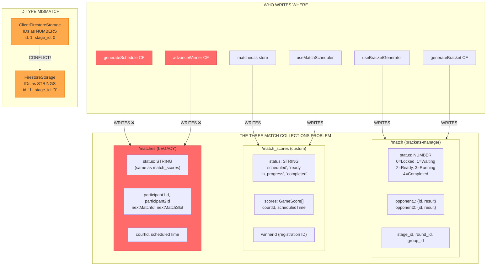
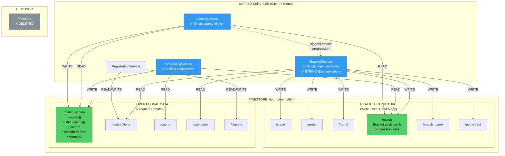
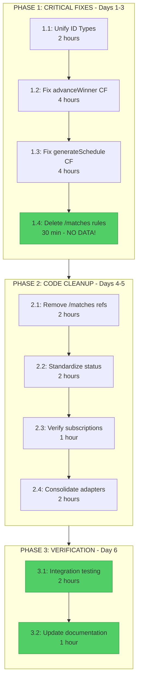
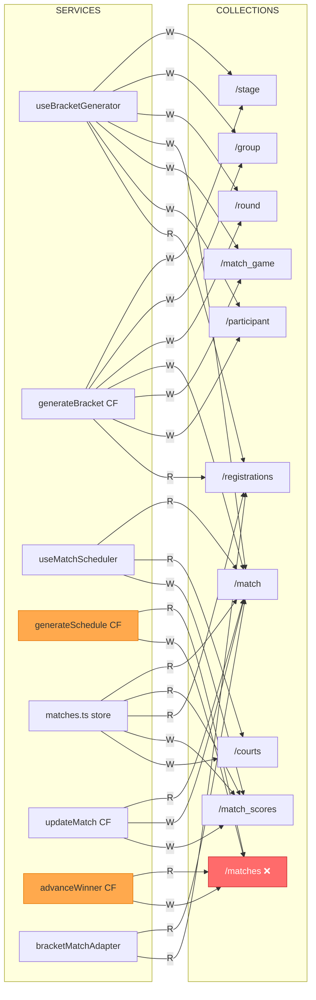

# Courtmaster Architecture Diagrams

This file contains all the Mermaid diagrams for the Courtmaster data model architecture.
You can render these diagrams using:
- VS Code with Mermaid extension
- GitHub (renders automatically in markdown)
- https://mermaid.live/ (online editor)

---

## 1. Current State - Data Flow Architecture

Shows the current broken state with data flow issues highlighted.

```mermaid
flowchart TB
    subgraph Client["CLIENT SIDE"]
        direction TB
        BG["useBracketGenerator.ts<br/>🔶 Uses NUMERIC IDs"]
        MS["useMatchScheduler.ts"]
        Store["matches.ts store"]
        Adapter["bracketMatchAdapter.ts"]
    end

    subgraph CloudFunctions["CLOUD FUNCTIONS"]
        direction TB
        GenBracket["generateBracket<br/>🔶 Uses STRING IDs"]
        GenSchedule["generateSchedule<br/>🔴 USES WRONG COLLECTION"]
        UpdateMatch["updateMatch"]
        AdvanceWinner["advanceWinner<br/>🔴 USES WRONG COLLECTION"]
    end

    subgraph Firestore["FIRESTORE: /tournaments/{id}/"]
        direction TB

        subgraph BracketsManager["Brackets-Manager Schema"]
            Stage["/stage"]
            Group["/group"]
            Round["/round"]
            Match["/match<br/>✅ PRIMARY"]
            MatchGame["/match_game"]
            Participant["/participant"]
        end

        subgraph Custom["Custom/Operational Schema"]
            MatchScores["/match_scores<br/>✅ KEEP"]
            Registrations["/registrations"]
            Categories["/categories"]
            Courts["/courts"]
            Players["/players"]
        end

        subgraph Legacy["LEGACY - TO BE REMOVED"]
            Matches["/matches<br/>🔴 REMOVE"]
        end
    end

    %% Client Bracket Generator
    BG -->|"WRITE (numeric IDs)"| Stage
    BG -->|"WRITE"| Group
    BG -->|"WRITE"| Round
    BG -->|"WRITE"| Match
    BG -->|"WRITE"| MatchGame
    BG -->|"WRITE"| Participant
    BG -->|"READ"| Registrations
    BG -->|"READ"| Categories

    %% Cloud Function Bracket Generator
    GenBracket -->|"WRITE (string IDs)"| Stage
    GenBracket -->|"WRITE"| Group
    GenBracket -->|"WRITE"| Round
    GenBracket -->|"WRITE"| Match
    GenBracket -->|"WRITE"| MatchGame
    GenBracket -->|"WRITE"| Participant

    %% Client Scheduler - CORRECT
    MS -->|"READ"| Match
    MS -->|"READ"| Courts
    MS -->|"WRITE"| MatchScores

    %% Cloud Function Scheduler - WRONG!
    GenSchedule -->|"READ ❌"| Matches
    GenSchedule -->|"WRITE ❌"| Matches

    %% Match Store
    Store -->|"READ"| Match
    Store -->|"READ"| MatchScores
    Store -->|"READ"| Registrations
    Store -->|"WRITE"| MatchScores
    Store -->|"WRITE"| Courts

    %% Update Match CF - CORRECT
    UpdateMatch -->|"READ"| Match
    UpdateMatch -->|"WRITE"| Match
    UpdateMatch -->|"WRITE"| MatchScores

    %% Advance Winner CF - WRONG!
    AdvanceWinner -->|"READ ❌"| Matches
    AdvanceWinner -->|"WRITE ❌"| Matches

    %% Adapter
    Adapter -->|"READ"| Match
    Adapter -->|"READ"| Registrations

    %% Styling
    style Matches fill:#ff6b6b,stroke:#c92a2a,color:#fff
    style GenSchedule fill:#ffa94d,stroke:#e67700,color:#000
    style AdvanceWinner fill:#ffa94d,stroke:#e67700,color:#000
    style BG fill:#ffe066,stroke:#fab005,color:#000
    style GenBracket fill:#ffe066,stroke:#fab005,color:#000
    style Match fill:#51cf66,stroke:#2f9e44,color:#000
    style MatchScores fill:#51cf66,stroke:#2f9e44,color:#000
```



---

## 2. Data Model Inconsistencies Map

Shows the specific conflicts between the three match collections.



---

## 3. Target State - Unified Architecture

Shows the clean target architecture after migration.



---

## 4. Migration Path - Accelerated Timeline (No Data!)

**IMPORTANT: Since there's no production data, the timeline is ~1 week, not 6 weeks!**



---

## 5. Service-to-Collection Matrix (Visual)



---

## Rendering Instructions

### VS Code
1. Install "Markdown Preview Mermaid Support" extension
2. Open this file and press `Ctrl+Shift+V` (or `Cmd+Shift+V` on Mac)

### GitHub
Mermaid diagrams render automatically in GitHub markdown files.

### Online
1. Go to https://mermaid.live/
2. Copy any diagram code between the ```mermaid blocks
3. Paste into the editor

### Export as Image
1. Use https://mermaid.live/
2. Click "Export" > "PNG" or "SVG"
3. Save to `/docs/architecture/images/`
